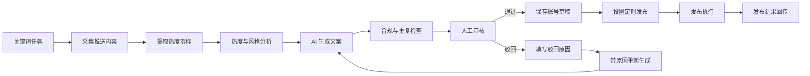

# 小红书内容运营系统方案与 UI 设计

## 1. 项目定位

本系统面向小红书内容运营团队，用于完成从关键词内容洞察、热度分析、AI 文案生成、人工审核、账号草稿保存到定时发布的完整运营链路。

设计目标：

- 提升选题与文案生产效率
- 保留人工审核质量闸门
- 支持驳回原因沉淀，并驱动重新生成
- 支持多账号草稿、排期和发布状态追踪
- 通过合规检查降低违规、重复、硬广和导流风险

相关设计稿：

- 核心流程图：https://www.figma.com/board/RetsXG2lCBJcGV04DS5k2v
- 完整 UI 设计稿：https://www.figma.com/design/NdzOifd8Dqvlw5KSM3AX3X

## 2. 核心业务链路



## 3. 用户角色

| 角色 | 权限与职责 |
| --- | --- |
| 运营 | 新建关键词任务、查看热点、生成文案、提交审核 |
| 审核人 | 查看审核列表、通过、编辑后通过、驳回并填写原因 |
| 发布管理员 | 管理账号授权、草稿保存、定时发布、失败处理 |
| 管理员 | 配置品牌语气、禁用词、审核规则、账号额度和权限 |

## 4. 信息架构

左侧导航：

1. 工作台
2. 关键词监控
3. 热点分析
4. 内容生成
5. 审核中心
6. 发布日历
7. 账号管理
8. 规则设置

## 5. 页面 UI 设计

### 5.1 工作台

用途：展示当天运营全局概览。

核心模块：

- 今日采集、待审核、已排期、发布失败指标卡
- 关键词热度趋势
- 待处理队列
- 今日发布排期
- AI 洞察摘要

关键状态：

- 待审核数量过高时显示提醒
- 发布失败进入异常队列
- AI 洞察提示风险内容与推荐发布时间

### 5.2 关键词监控

用途：管理关键词采集任务。

表格字段：

| 字段 | 说明 |
| --- | --- |
| 关键词 | 运营监控词 |
| 类目 | 美妆、时尚、食品、本地等 |
| 最近采集 | 最近一次同步时间 |
| 样本数 | 当前周期抓取/导入样本 |
| 平均热度 | 综合热度均值 |
| 爆款数 | 超过阈值的笔记数 |
| 状态 | 运行中、暂停、异常 |
| 操作 | 查看、暂停、启动、编辑 |

详情区域：

- 标题结构
- 高频词
- 评论焦点
- 生成建议

### 5.3 热点分析

用途：查看爆文样本和风格拆解。

核心区域：

- 筛选器：关键词、时间范围、排序方式
- 爆文列表：标题、浏览、点赞、评论、收藏、热度分、发布时间
- 评论关注点：高频问题标签
- 风格拆解：语气、结构、标题套路、封面方式、风险点

热度分建议：

```text
热度分 = log(浏览量) * 0.25
       + 点赞率 * 0.25
       + 评论率 * 0.20
       + 收藏率 * 0.20
       + 新鲜度 * 0.10
```

### 5.4 内容生成

用途：根据热点洞察生成可审核内容。

左侧参考洞察：

- 关键词
- 目标人群
- 语气风格
- 产品/账号卖点
- 禁用表达

右侧生成结果：

- 标题候选
- 正文编辑器
- 封面文案
- 话题标签
- 合规检查标签

底部操作：

- 重新生成
- 保存草稿
- 提交审核

### 5.5 审核中心

用途：完成人工审核闭环，是系统核心页面。

筛选维度：

- 全部
- 待审核
- 已驳回
- 已通过
- 发布失败
- 关键词
- 账号
- 风险等级
- 审核人

列表字段：

| 字段 | 说明 |
| --- | --- |
| 标题 | AI 生成内容标题 |
| 关键词 | 来源关键词任务 |
| 账号 | 目标发布账号 |
| 风险 | 低风险、中风险、高风险 |
| 状态 | 待审核、已驳回、已通过 |
| 审核人 | 当前处理人 |
| 操作 | 查看、通过、驳回、重新生成 |

详情抽屉：

- 标题
- 正文预览
- 封面文案
- 标签
- 合规与质量检查
- 生成依据
- 历史驳回原因

审核动作：

- 通过：进入保存账号草稿流程
- 编辑后通过：保留人工修改记录
- 驳回并重新生成：必须填写驳回原因和重新生成要求

驳回弹窗字段：

```text
驳回原因 *
示例：标题太夸张，缺少真实体验感

重新生成要求
示例：保留产品卖点，减少促销语气，加入个人使用场景
```

### 5.6 发布日历

用途：管理多账号内容排期。

视图：

- 月视图
- 周视图
- 日视图

日历卡片内容：

- 发布时间
- 账号
- 标题
- 状态

冲突提醒：

- 同账号发布时间过密
- 同关键词内容重复
- 草稿未保存成功
- 未通过最终审核
- 合规检查未通过

### 5.7 账号管理

用途：管理账号授权、额度和发布策略。

表格字段：

| 字段 | 说明 |
| --- | --- |
| 账号 | 账号名称 |
| 类型 | 品牌号、企业号、个人号 |
| 授权 | 正常、待确认、失效 |
| 今日排期 | 当前发布数量/每日上限 |
| 最近发布 | 最近一次发布时间 |
| 异常状态 | 无异常、需登录、发布受限 |
| 操作 | 设置、处理、查看日志 |

账号策略：

- 每日最大发布量
- 同类内容发布间隔
- 默认审核人
- 禁用词库
- 推荐发布时间

### 5.8 规则设置

用途：配置 AI 生成与审核规则。

配置项：

- 品牌语气：真实分享、轻专业、少广告感、朋友式提醒
- 禁用表达：功效绝对化、诱导互动、站外导流等
- 审核规则：高风险二审、驳回必填原因、发布前重复度检查
- 生成模板：痛点提醒型、清单干货型、真实测评型、评论答疑型

## 6. 内容状态流转

| 状态 | 说明 | 下一步 |
| --- | --- | --- |
| 已采集 | 已获取关键词相关样本 | 热度分析 |
| 已分析 | 已完成指标和风格拆解 | AI 生成 |
| 已生成 | 已生成标题、正文、标签 | 提交审核 |
| 待审核 | 等待人工审核 | 通过或驳回 |
| 已驳回 | 审核人填写原因 | 重新生成 |
| 重新生成中 | 带驳回原因再次生成 | 待审核 |
| 已通过 | 审核通过 | 保存草稿 |
| 草稿保存中 | 写入账号草稿队列 | 已保存草稿 |
| 已保存草稿 | 可进入发布排期 | 待发布 |
| 待发布 | 已设置发布时间 | 发布执行 |
| 已发布 | 发布成功 | 结果回传 |
| 发布失败 | 发布异常 | 人工处理或重试 |

## 7. 数据模型

```text
KeywordTask
- id
- keyword
- category
- frequency
- sampleLimit
- status
- createdBy
- createdAt

SourcePost
- id
- keywordTaskId
- title
- contentSummary
- url
- metrics
- publishedAt
- capturedAt

InsightReport
- id
- keywordTaskId
- hotScore
- titlePatterns
- styleTags
- audiencePainPoints
- riskHints

GeneratedContent
- id
- keywordTaskId
- accountId
- title
- body
- coverText
- tags
- riskLevel
- duplicateScore
- status
- version

ReviewRecord
- id
- contentId
- reviewerId
- decision
- rejectReason
- regenerateInstruction
- reviewedAt

PublishTask
- id
- contentId
- accountId
- scheduledAt
- status
- failureReason
- publishedUrl
- createdAt
```

## 8. 合规与风控原则

- 优先使用官方授权接口、合规数据源或人工导入，不默认绕过平台限制抓取。
- AI 只能模仿结构、语气和表达节奏，不复制原文。
- 商业推广、功效承诺、站外导流、诱导互动等内容必须进入风险检查。
- 发布动作应保留人工审核和可追踪日志。
- 对失败、异常、账号受限状态做显式提示，不静默重试。

## 9. MVP 范围

第一期建议实现：

- 关键词任务管理
- 内容导入/采集记录
- 热度指标分析
- 风格拆解
- AI 文案生成
- 审核列表
- 驳回原因与重新生成
- 发布日历
- 多账号状态管理

第二期增强：

- 发布后数据回流
- A/B 文案版本
- 素材库
- 封面模板
- 多人协作权限
- 二审流程
- 自动排期建议
